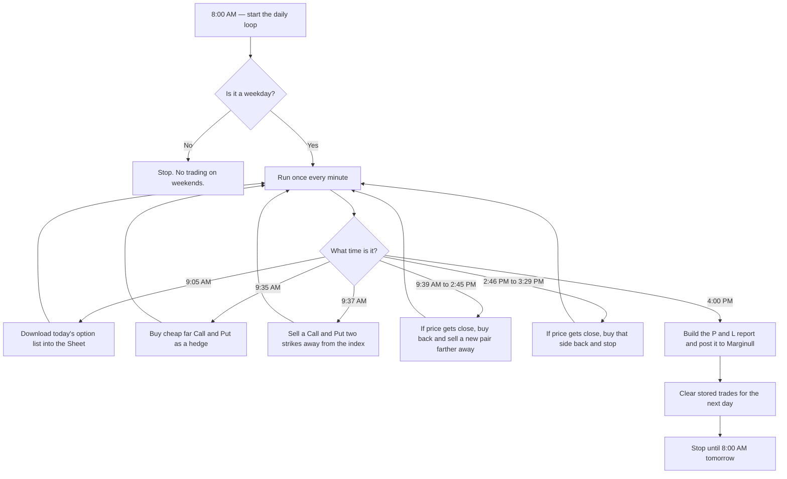
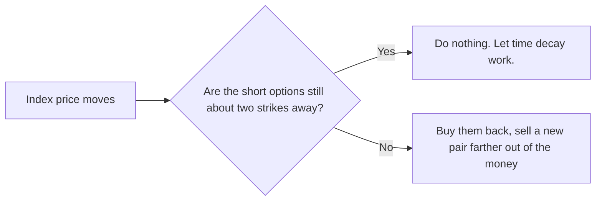

# dhan

This project is **outdated and no longer maintained**.

It is kept here for historical reference only. Do not run it against a live brokerage account.

## What this was

A Google Apps Script, attached to a Google Sheet, that traded index options automatically through the [Dhan](https://dhan.co) API.

After the market closed, it posted a daily profit-and-loss report to the Marginull community, which ran on [Flarum](https://flarum.org) (open-source forum software). **The Marginull forum no longer exists.**

The strategy was nicknamed **Moneyness Ninja**: sell options that are a bit out of the money, and try to keep them out of the money until expiry so the premium (time decay) is kept.

## How a trading day worked

Each weekday the script traded **that day's weekly expiry** on one index:

| Day | Index |
| --- | --- |
| Monday | MIDCPNIFTY |
| Tuesday | FINNIFTY |
| Wednesday | BANKNIFTY |
| Thursday | NIFTY |
| Friday | SENSEX |

Weekends were skipped.

Rough timeline:

1. **8:00 AM** — A daily trigger starts a loop that runs once every minute.
2. **9:05 AM** — Download Dhan's option list (which contracts exist today) into the Sheet. Also check whether the API key is about to expire.
3. **9:35 AM** — Buy cheap, far out-of-the-money Call and Put options. These were a hedge, not the main trade.
4. **9:37 AM** — Sell a Call and a Put that sit about **two strikes** away from the current index price. Those IDs are saved in the Sheet so later steps know what is open.
5. **9:39 AM – 2:45 PM** — Every minute, check the index. If price has moved too close to either short option, buy both back and sell a new pair two strikes away again.
6. **2:46 PM – 3:29 PM** — Last safety window. If price is getting close to a remaining short option, buy that side back and stop adjusting.
7. **4:00 PM** — Pull the day's positions and orders from Dhan, write a report, post it to Marginull as a new Flarum discussion, then clear the stored trade cells for tomorrow.

The main idea in one picture:

Orders went through Dhan (`https://api.dhan.co`). Activity was logged in a `Log` sheet. Errors could also send an email alert.

## Marginull and Flarum

**The Marginull forum no longer exists.** Links to `marginull.com` below are historical only.

Marginull was a trading community built on **Flarum**. Flarum exposes a REST API, so the script could create forum posts without opening a browser.

At 4:00 PM the script:

1. Fetched the day's **positions** and **orders** from Dhan.
2. Stored them in the `Positions` and `Orders` sheets.
3. Built a markdown report: P&L table, trade list, and a short note on how volatile the day felt.
4. `POST`ed that report to `https://marginull.com/api/discussions` as a new discussion.

The title looked like:

`Day 12: P&L and Trade Analysis Report for Moneyness Ninja Strategy`

Posts were tagged so they showed up with the other P&L reports on the forum. The report text also linked back to a Moneyness Ninja strategy thread on Marginull.

API keys in this repo are placeholders only. Real Dhan and Flarum credentials lived in the Google Apps Script editor, not in git.

## Google Sheet tabs

The script expected these sheets in the same spreadsheet:

| Sheet | Used for |
| --- | --- |
| `Scrip` | Today's option contracts downloaded from Dhan |
| `Data` | Open Call/Put IDs, symbols, strike values, day counter |
| `Positions` | End-of-day positions for the report |
| `Orders` | End-of-day trades for the report |
| `Log` | Timestamped messages from each step |

## Files

| File | Role |
| --- | --- |
| `master.gs` | Shared names, URLs, and lot size |
| `scheduler.gs` | Daily clock and which function runs when |
| `importMasterCSV.gs` | Load Dhan's option list |
| `getSecurityID.gs` | Look up a contract ID from the Sheet |
| `getRealtimePrice.gs` | Read live/index option prices from Dhan |
| `executeOrder.gs` | Place, check, or cancel an order |
| `buyDecayOrder.gs` | Morning hedge buys |
| `firstShortOrder.gs` | First short Call and Put |
| `bracketOrder.gs` | Intraday adjust / roll |
| `lastSquareOffOrder.gs` | Late-day safety exit |
| `postMarginull.gs` | Build the report and post it to Flarum |
| `logMessage.gs` | Logging, email alerts, end-of-day cleanup |
| `otherRepo.gs` | Old experiments. Not used by the live flow. |
